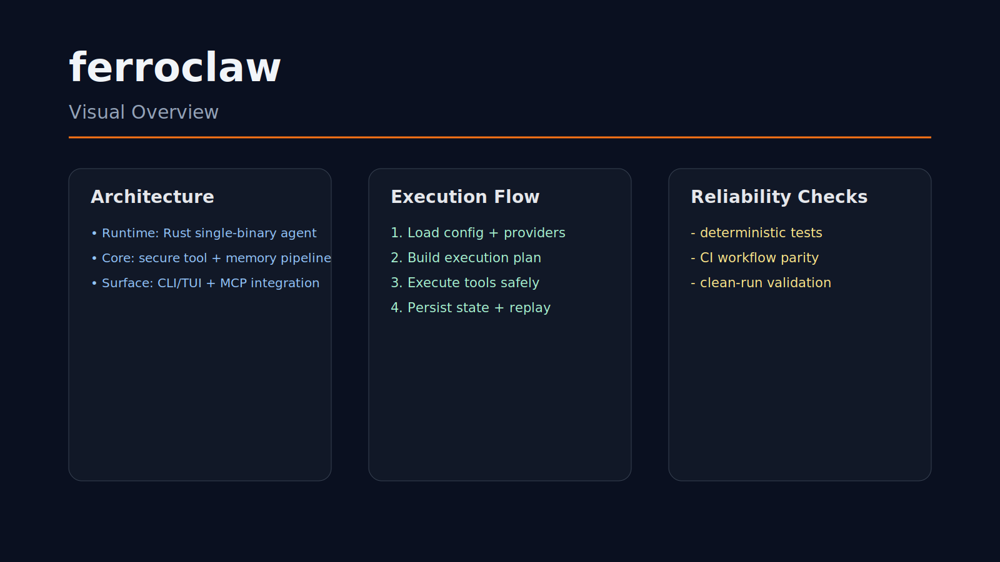

# ferroclaw

Security-first single-binary Rust agent framework.

## Installation

1) Install Rust toolchain
```bash
curl https://sh.rustup.rs -sSf | sh
rustup default stable
```


2) Clone and enter the repo
```bash
git clone <repo-url>
cd <repo-name>
```

## Quick Start

```bash
cargo build --release
cargo run --release
```

## Usage Examples

- Run locally
```bash
cargo run --release
```

- Build production artifacts
```bash
cargo build --release
```

- Run tests
```bash
cargo test --all
```

- Launch CLI help
```bash
cargo run -- --help
```

## Implementation Overview

This repository is implemented primarily in **Rust** and organized around explicit runtime entrypoints plus supporting modules.

### Key Directories

- `.ecc-design/`
- `.github/`
- `benches/`
- `docs/`
- `evals/`
- `examples/`
- `scripts/`
- `src/`

### Key Files

- `Cargo.toml`
- `README.md`
- `LICENSE`
- `.github/workflows/ci.yml`

### Entrypoints

- `src/main.rs`
- `src/lib.rs`

## Troubleshooting

- If startup fails, run the primary command with verbose flags and capture stderr logs.
- If dependencies conflict, remove lock artifacts and reinstall in a clean shell.
- If tests fail intermittently, run a single test target first, then full suite.
- Ensure environment variables are loaded before running build/train commands.

## Visual Overview




## Problem
Production agents need auditable control loops and constrained side effects.

## Reproducibility
```bash
cargo build --release
cargo test --all
```

## Limits
Provider/tool parity remains an ongoing engineering target.
